# PEs and P/B
Karl Polen  
April 21, 2016  
Following are some charts for each of the SAA categories for our equity assets.  I present PE Ratio, Price to Book ratio and 360 day volatility.  On each chart I plot long term averages for these statistics -- red is 10 year moving average, green is 15 year moving average and purple is 20 year moving average.

These are all pulled from Bloomberg but plotted in R.  (I couldn't figure out how to add the moving average lines for the statistics on the BBG, so did it in R.).  

Note the data look funny for EAFE small cap.  I have contacted Bloomberg to check it.

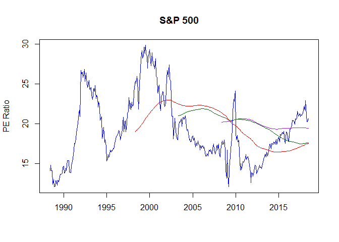<!-- -->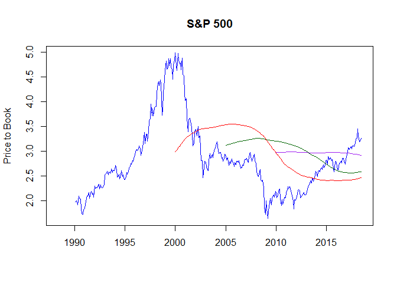<!-- -->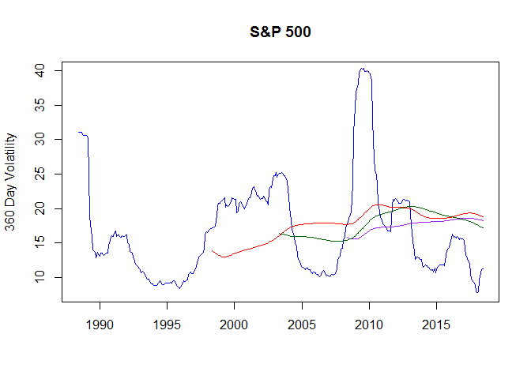<!-- -->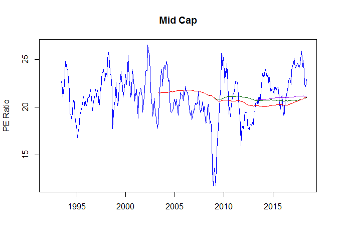<!-- -->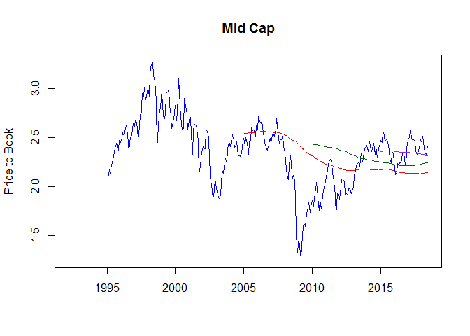<!-- -->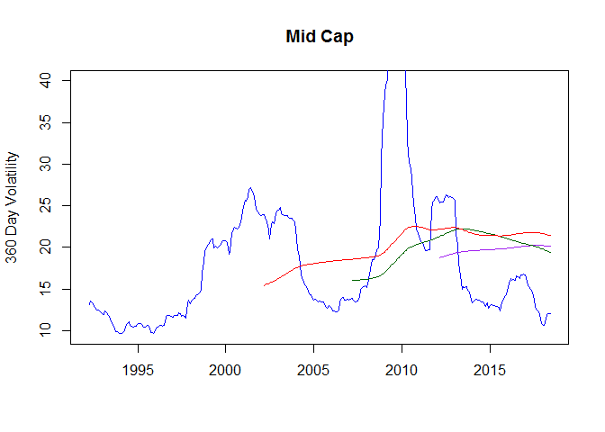<!-- -->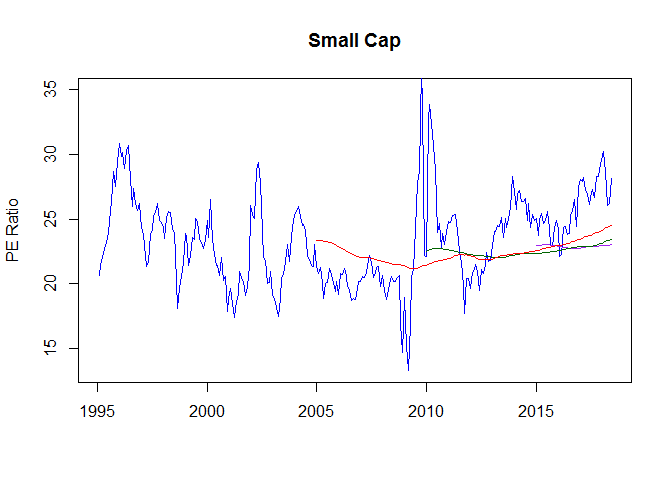<!-- -->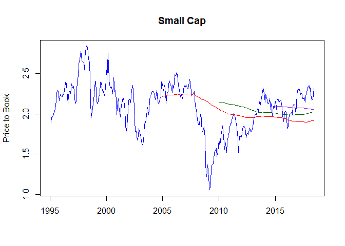<!-- -->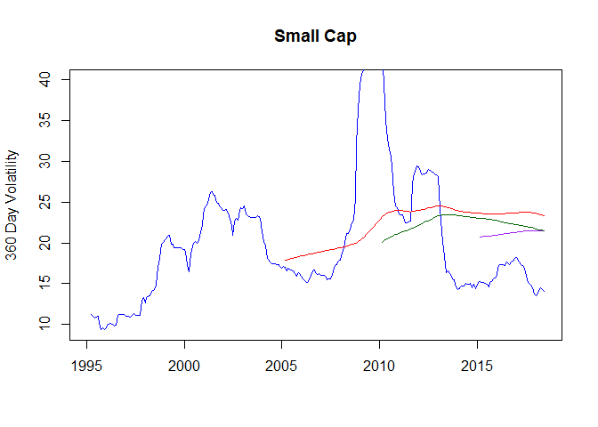<!-- -->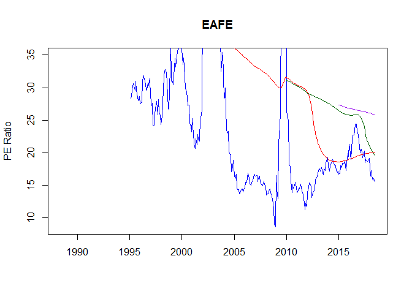<!-- -->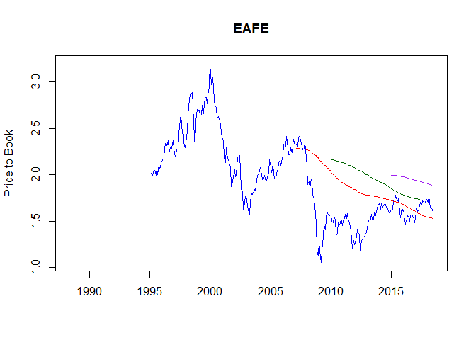<!-- -->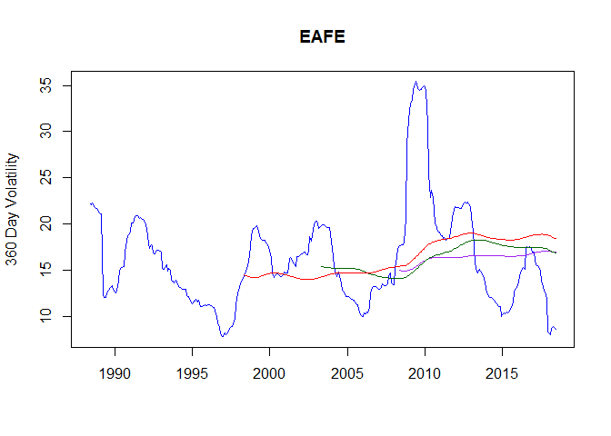<!-- -->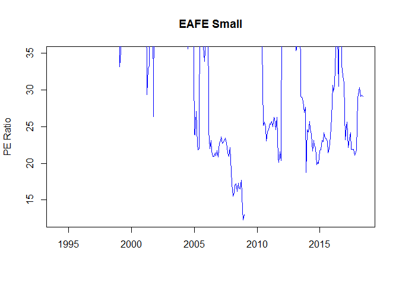<!-- -->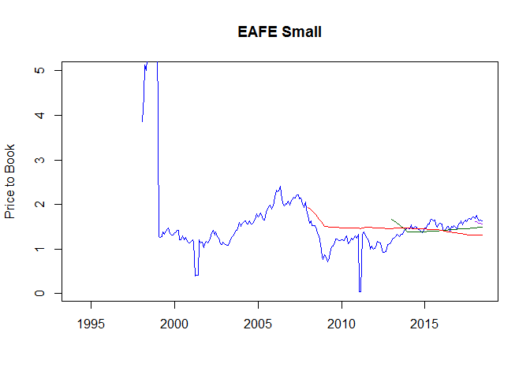<!-- -->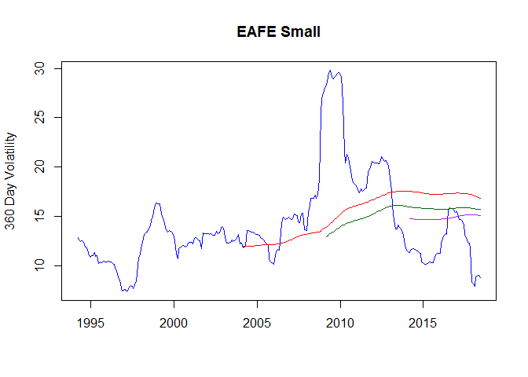<!-- -->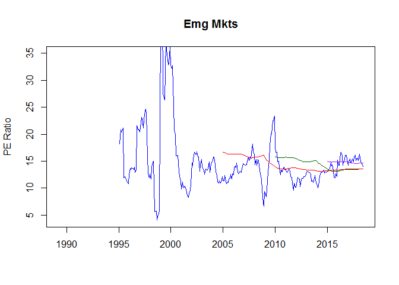<!-- -->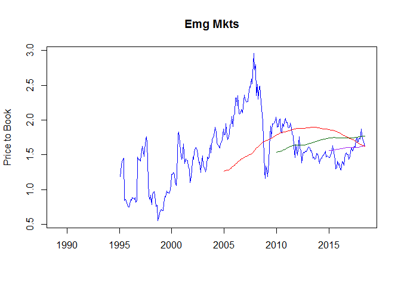<!-- -->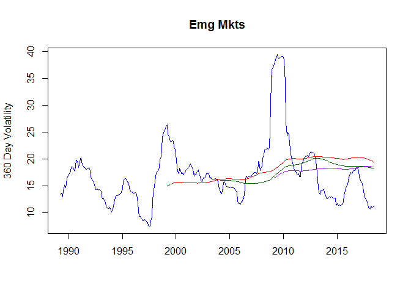<!-- -->
